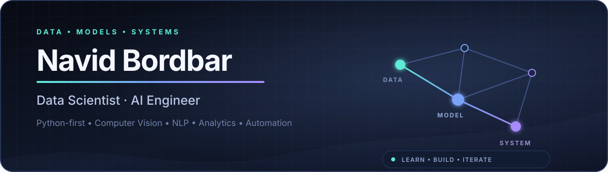

  

  
  
  
  

  <strong>Python-first problem solver working across data, intelligent models, and practical software.</strong>

## Profile

I'm **Navid Bordbar**, a **Data Scientist and AI Engineer** focused on turning raw data into useful, reliable systems.

My work and learning span the full applied-AI path: exploring and explaining data, training and evaluating machine-learning models, studying deep learning for vision and language, and connecting those capabilities to software and automated workflows.

I value strong fundamentals, readable code, honest evaluation, and solutions that are practical beyond the notebook.

## What I Work On

| | Focus | What it means in practice |
|:--:|---|---|
| **01** | **Data & Analytics** | Data preparation, exploratory analysis, SQL, visualization, dashboards, and decision support |
| **02** | **Machine Learning** | Supervised and unsupervised learning, model selection, evaluation, and deep-learning foundations |
| **03** | **Vision & Language** | Image processing, computer vision, NLP, transformers, and language-model foundations |
| **04** | **AI Engineering** | Python applications, Django backends, reproducible workflows, and intelligent automation with n8n |

## Technical Toolkit

**Languages & engineering**

**AI & machine learning**

**Data & automation**

## Current Focus

- Advancing practical **Computer Vision** skills and deep-learning workflows.
- Deepening **NLP, transformers, and language-model** foundations.
- Building stronger backend engineering skills with **Django**.
- Designing useful **n8n automation** and AI-assisted workflows.

> I approach AI as a complete system: understand the data, choose the right model, evaluate it honestly, and engineer the surrounding software so it remains useful.

### Open to learning, collaboration, and meaningful AI conversations.

**[Email](mailto:navid.b1515@gmail.com) · [LinkedIn](https://www.linkedin.com/in/navid-bordbar) · [Kaggle](https://www.kaggle.com/navidbordbar) · [Hugging Face](https://huggingface.co/navidbordbar)**

