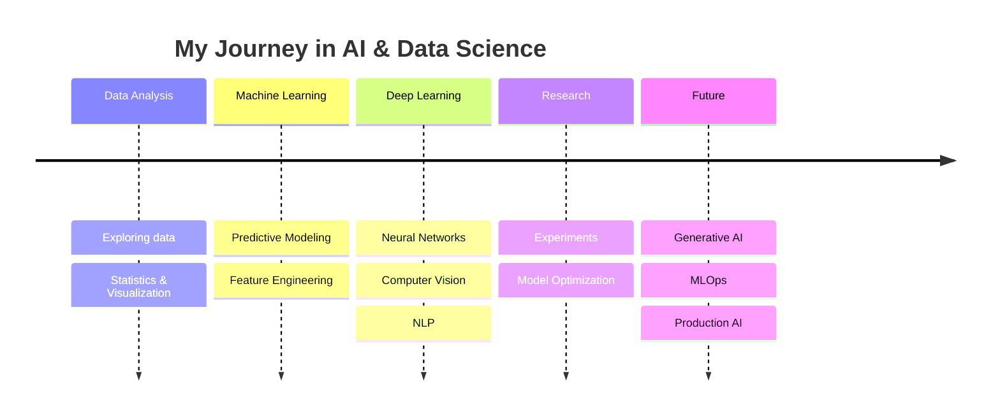

# 👋 Hi, I'm Navid

<div align="center">

### 🧠 Data Scientist · Machine Learning Engineer · AI Enthusiast


<br/>

[](https://github.com/navidml)
[](https://github.com/navidml)

</div>

---

## 🧬 About Me

I'm a **Data Scientist** passionate about building intelligent systems that turn complex data into meaningful insights and practical solutions.

My interests span across:

* 🤖 **Machine Learning & Predictive Modeling**
* 🧠 **Deep Learning & Neural Networks**
* 💬 **Natural Language Processing**
* 👁️ **Computer Vision & Image Processing**
* 📊 **Data Analysis & Visualization**
* 🔬 **Research & Experimental Modeling**
* 🚀 **AI-powered real-world applications**

I enjoy going beyond simply training models — from **data exploration and feature engineering** to **model development, evaluation, experimentation, and deployment**.

> *"The goal is to turn data into knowledge, and knowledge into intelligent decisions."*

---

## ⚡ What I Work With

<table>
<tr>
<td valign="top" width="50%">

### 🧠 AI & Machine Learning


**Machine Learning**

* Supervised & Unsupervised Learning
* Predictive Modeling
* Feature Engineering
* Model Evaluation & Optimization
* Neural Networks
* Deep Learning

</td>

<td valign="top" width="50%">

### 👁️ Computer Vision & NLP


**Focus Areas**

* Image Processing
* Computer Vision
* Natural Language Processing
* Representation Learning
* Data Preprocessing
* Experimental Research

</td>
</tr>

<tr>
<td valign="top">

### 📊 Data Science


* Exploratory Data Analysis
* Statistical Analysis
* Data Visualization
* Data Cleaning
* Feature Engineering
* Predictive Analytics

</td>

<td valign="top">

### 🛠️ Tools & Workflow


**Workflow**

* Research & Experimentation
* Version Control
* Reproducible Analysis
* Model Prototyping
* Technical Documentation

</td>
</tr>
</table>

---

## 🔭 Currently Exploring

```text
Deep Learning        ███████████████████░░   90%
Computer Vision      ██████████████████░░░   85%
Machine Learning     ███████████████████░░   90%
NLP                  ████████████████░░░░░   75%
Data Science         ████████████████████░   95%
MLOps                ████████████░░░░░░░░░   60%
Generative AI        ██████████████░░░░░░░   70%
```

---

## 🚀 Featured Work

<div align="center">

<a href="https://github.com/navidml?tab=repositories">

</a>

<a href="https://github.com/navidml?tab=repositories">

</a>

</div>

> 💡 Replace `REPOSITORY_1` and `REPOSITORY_2` with two of your strongest projects.

---

## 📈 GitHub Analytics

<div align="center">


</div>

<br/>

<div align="center">


</div>

---

## 🐍 Contribution Graph

<div align="center">


</div>

---

## 🏆 Achievements

<div align="center">


</div>

---

## 🧪 My AI Journey



---

## 💡 Areas of Interest

<div align="center">

`Artificial Intelligence` ·
`Machine Learning` ·
`Deep Learning` ·
`Computer Vision` ·
`NLP` ·
`Predictive Modeling` ·
`Data Science` ·
`Research` ·
`Generative AI` ·
`MLOps`

</div>

---

## 📚 What I'm Learning

<table>
<tr>
<td>🤖 Generative AI</td>
<td>🧠 Advanced Deep Learning</td>
</tr>
<tr>
<td>🔍 Explainable AI</td>
<td>⚙️ MLOps & Model Deployment</td>
</tr>
<tr>
<td>👁️ Advanced Computer Vision</td>
<td>💬 Modern NLP & LLMs</td>
</tr>
</table>

---

## 📊 Coding Philosophy

> ### Data → Insight → Model → Experiment → Intelligence

I believe great AI systems aren't created by models alone.

They come from understanding the **data**, asking the right **questions**, designing meaningful **experiments**, and continuously improving through **iteration**.

---

## 🤝 Let's Connect

<div align="center">

I'm always interested in discussing:

**AI · Machine Learning · Research · Computer Vision · NLP · Data Science · Open Source**

<br/>

<a href="https://github.com/navidml">

</a>

</div>

---

<div align="center">

### ⭐ If you find something interesting here, consider giving it a star!

<br/>


</div>
